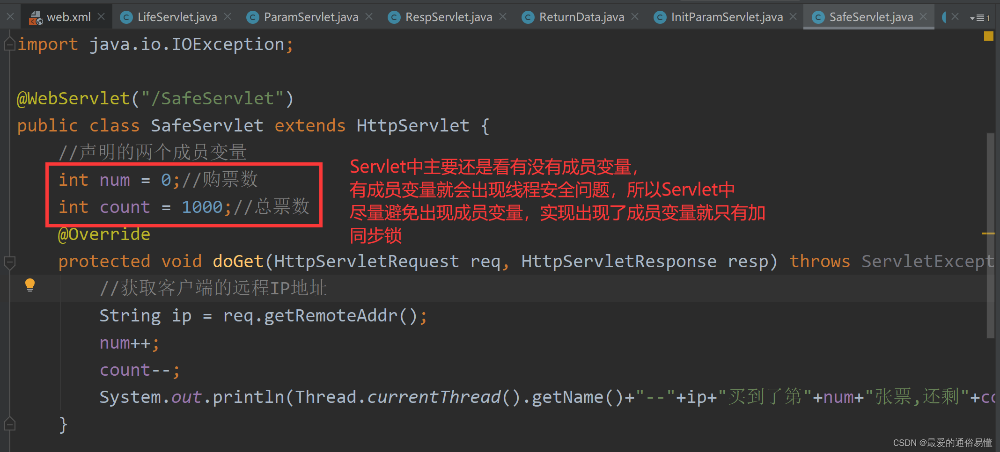

# Servlet详解

+ ## Servlet获取参数
    + getParameter()：调用 request.getParameter() 方法来获取表单参数的值。
    + getParameterValues()：如果参数出现一次以上，则调用该方法，并返回多个值，例如复选框。
    + getParameterNames()：如果您想要得到当前请求中的所有参数的完整列表，则调用该方法。
    + getParameterMap(): 返回所有参数的一个map 每个节点类型为<String,String[]>
    + getQueryString(): 返回请求的url，注意这里是经过utf-8编码过的，所以使用前要进行解码，然后自行解析
        ```
        url = URLDecoder.decode(reqStr,"utf-8");
        ...
        ...
        ```
  
***
+ ## Servlet响应页面和数据
  响应页面，也就是收到前端的请求响应需要跳转的页面。
  
  Servlet响应页面有转发和重定向两种方式。
  > 转发-- 携带客户端发送的请求转发跳转到下一个页面，使用的是request请求对象，请求地址将会刷新，第一个请求的请求参数也会丢失。
  ```
    request.getRequestDispatcher("要跳转的页面路径").forward(request,response)
  ```
  > 重定向-- 服务器接收到前端请求，通过响应将要跳转的页面地址响应给客户端，客户端再重新发送请求跳转到目标页面，请求地址不会刷新，所以请求参数还保持。
  ```
    response.redirect("重定向的页面路径")
  ```

***
+ ## Servlet线程安全问题
  同一个Servlet在服务器中只会存在一个实例，不论是多少个访问，都调用的是同一个实例，也就是Servlet是单实例多线程的。
  
  > 也就是说，不同用户同一时间访问同一个网址时，其实访问的是同一个servlet对象，只不过这个servlet对象会开不同的线程给不同用户提供服务(调用service/doGet/doPost...)
  
  这就存在着一定的线程安全问题，如果在Servlet中定义一个全局变量，那么程序运行这个变量的值很有可能会不是我们所预期的，**所以在Servlet中要尽量避免使用全局变量。** 
  
  > 可以使用只读的全局变量，但是如果对全局变量有写操作，需要添加同步锁

  例如运行如下程序实例Servlet的线程安全问题：
  


