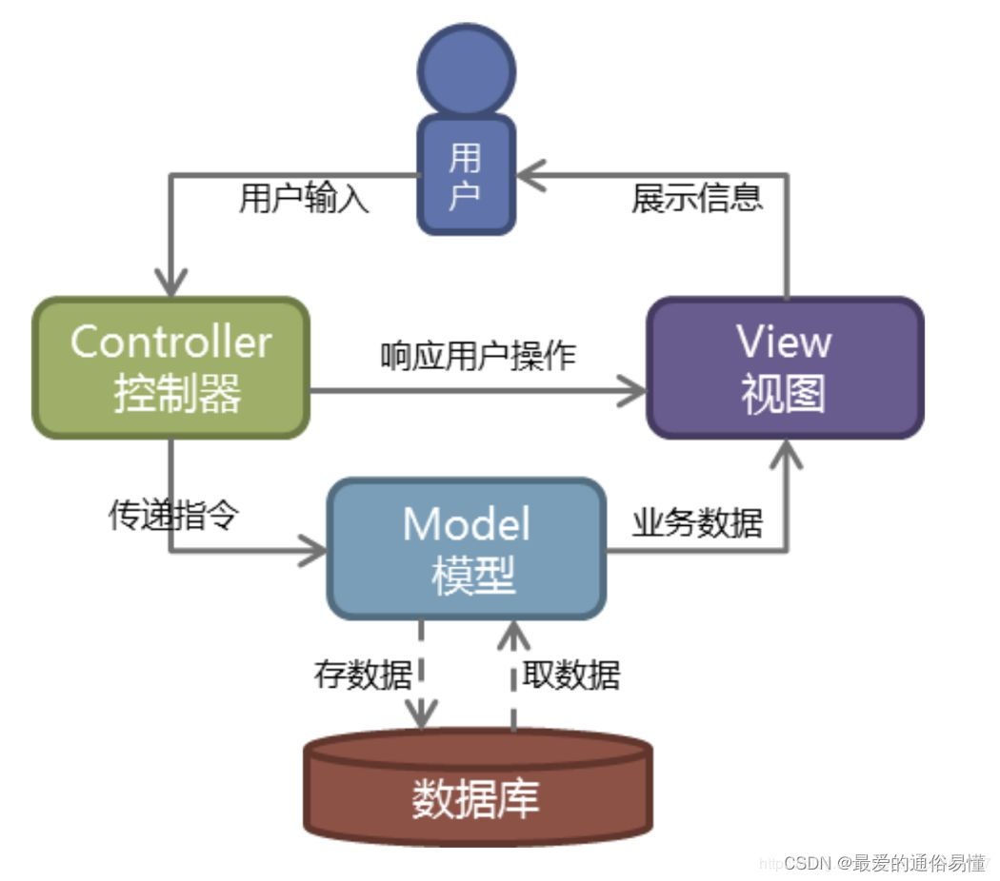
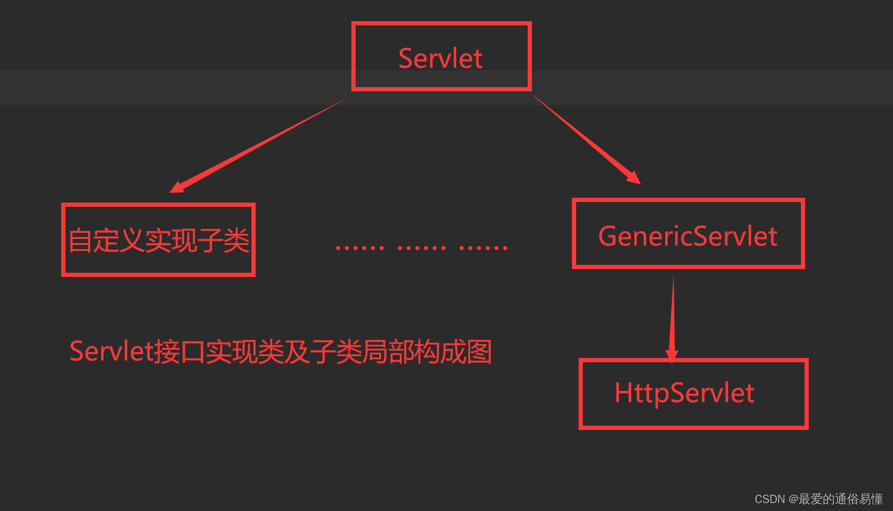

# Servlet 简介

## 什么是Servlet ##
Servlet是Server Applet的简称，翻译过来就是服务程序。是由sun公司提供的一门用于开发动态Web资源的技术。简单的讲，Servlet就是运行在服务器上的一个小程序，用来处理服务器接收到的请求。

比如一般的网页程序，是由我们通过浏览器来访问实现的，在这个过程中，我们的浏览器发送访问请求，服务器接收到请求，并对浏览器的请求做出相应的处理，这就是我们熟悉的B/S模型（浏览器—服务器模型）。而Servlet就是对请求做出处理的组件，运行于支持java的应用服务器中。

Servlet从狭义上说白了就是个接口，从广义上说就是实现了这个接口的所有的子类。


***
## Servlet 作用 ##
在Servlet刚刚出现的年代，Servlet的作用十分复杂，即承担了处理数据的作用，又承担了展示页面的作用，导致代码的耦合性过高,不易于维护。随着时间的推移，出现了MVC思想，也就是模型 - 界面 - 控制器思想，极大的简便了开发，也明确了Servlet的作用。

最经典的MVC模型是：JSP+JavaBean+Servlet开发模式

*Servlet在其中承担的作用是Controller（控制器）,起到对数据进行操作的作用*

***
## Servlet 结构

从上图可以看出，我们编写Servlet一般有两种方式，一种是实现Servlet接口，另外一种更简单的是继承HttpServlet

+ ## (interface) Servlet  
```public interface Servlet {
    // Servlet初始化的时候调用一次
    void init(ServletConfig var1) throws ServletException;
    
    ServletConfig getServletConfig();
    // 每次访问Servlet都会调用
    void service(ServletRequest var1, ServletResponse var2) throws ServletException, IOException;

    String getServletInfo();
    // Servlet销毁前调用一次(服务器关闭)
    void destroy();
}
```

+ ## GenericServlet
    每次服务器接收到一个 Servlet 请求时，服务器会产生一个新的线程并调用服务。service() 方法检查 HTTP 请求类型（GET、POST、PUT、DELETE 等），并在适当的时候调用 doGet、doPost、doPut，doDelete 等方法

    我们在子类中重写doGet、doPost、doPut，doDelete 

    *eg: doGet()*
    ```
    public void doGet(HttpServletRequest request,
                  HttpServletResponse response)
    throws ServletException, IOException {
    // Servlet 代码
    }
    ```

    *eg: doPost()*
    ```
    public void doPost(HttpServletRequest request,
                   HttpServletResponse response)
    throws ServletException, IOException {
    // Servlet 代码
    }
    ```

***
## 配置web.xml文件或者使用WebServlet注解进行配置

+ ## 网址与Servlet映射
  > 配置web.xml的方式
    ```
        <!-- 配置Servlet名称和类名映射 -->
        <servlet>
            <!-- Servlet的名字 -->
            <servlet-name>MyServer</servlet-name>
            <!-- Servlet的类名 -->
            <servlet-class>MyServer</servlet-class>
        </servlet>

        <!-- 配置Servlet名称和访问地址映射 -->
        <servlet-mapping>
            <!-- Servlet的名字 -->
            <servlet-name>MyServer</servlet-name>
            <!-- Servlet的访问路径 -->
            <url-pattern>/MyServer</url-pattern>
        </servlet-mapping>
    ```
  > 使用WebServlet注解
    ```
    @WebServlet(name="MyServer",urlPatterns = "/MyServer")
    public class MyServer implements Servlet {
        ...
    }
    ```

***
+ ## WebServlet注解不生效时:
    
    > 版本3.0以及以上

    > metadata-complete = "false" (true时表示只是用xml中的配置进行映射)

      ```
      <web-app xmlns="http://xmlns.jcp.org/xml/ns/javaee"
             xmlns:xsi="http://www.w3.org/2001/XMLSchema-instance"
             xsi:schemaLocation="http://xmlns.jcp.org/xml/ns/javaee
                          http://xmlns.jcp.org/xml/ns/javaee/web-app_3_1.xsd"
             version="3.1"
             metadata-complete="false">
      ```
+ ## Servlet加载
  在web.xml中，配置Servlet时可以同时配置加载选项          *load-on-startup*
    ```
    <servlet>
        <servlet-name>MyServer2</servlet-name>
        <servlet-class>MyServer2</servlet-class>
        <load-on-startup>-1</load-on-startup>
    </servlet>
    ```
    >-1:首次访问时加载该Servlet

    >\>=0:服务器启动时就加载该Servlet，值越小越先加载

***
+ ## Servlet参数
    在web.xml中，配置Servlet时可以同时配置加载参数，这样就可以把一些配置参数提取到配置文件中，更改配置时只需要更改xml文件就可以了，不需要重新编译打包
    ```
    <servlet>
        <init-param>
            <param-name>key</param-name>
            <param-value>param</param-value>
        </init-param>
    </servlet>
    ``` 

    *对于所有servlet共用的参数，可以通过全局配置来实现*
    ```
    <context-param>
        <param-name></param-name>
        <param-value></param-value>
    </context-param>
    ```

    >## Servlet中读取参数配置
    >

***
# ServletContext
+ 当Tomcat启动的时候，就会创建一个ServletContext对象。它其实就是整个所有Servlet的共享上下文对象

+ ServletContext既然代表着当前web站点，那么所有Servlet都共享着一个ServletContext对象，所以Servlet之间可以通过ServletContext实现通讯。
+ ServletConfig获取的是配置的是单个Servlet的参数信息，ServletContext可以获取的是配置整个web站点的参数信息
+ 利用ServletContext读取web站点的资源文件


+ 实现Servlet之间通讯就要用到ServletContext的setAttribute(String name,Object obj)方法，
第一个参数是关键字，第二个参数是你要存储的对象

*可以通过ServletContext获取站点的文件流*
```
//获取到ServletContext对象
ServletContext servletContext = this.getServletContext();

//调用ServletContext方法获取到读取文件的流
InputStream inputStream = servletContext.getResourceAsStream("/WEB-INF/xxx/xxx/xxx..");
```