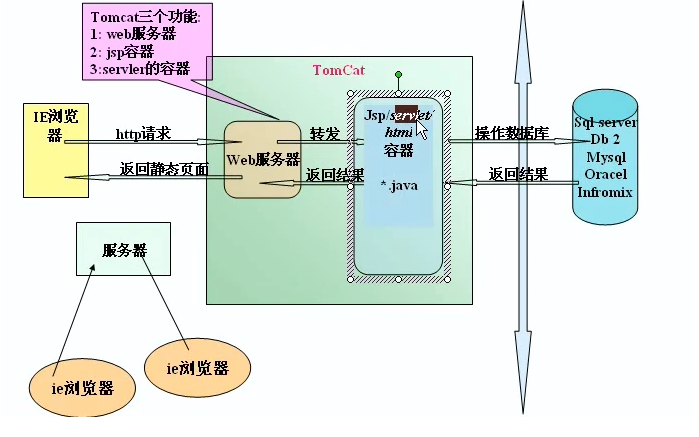
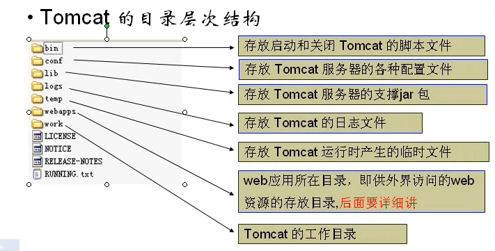
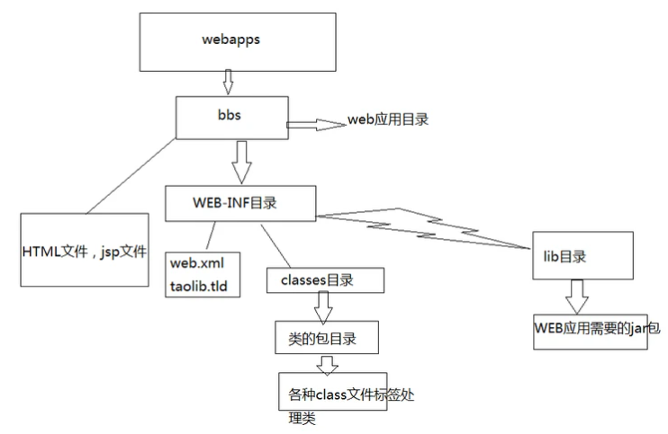
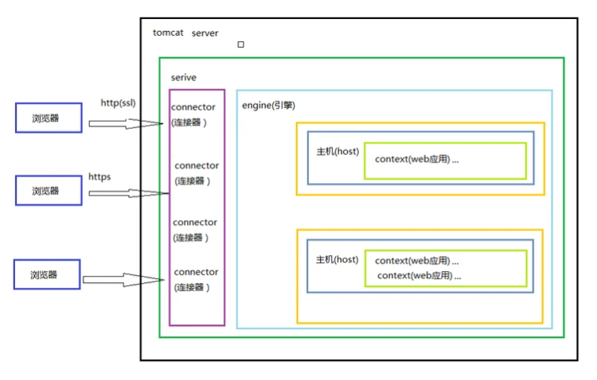

# Tomcat 知识总结
参考资料：[Tomcat就是这么简单](https://segmentfault.com/a/1190000013122831)

***
## 什么是Tomcat
Tomcat简单的说就是一个运行JAVA的网络服务器，底层是Socket的一个程序，它也是JSP和Serlvet的一个容器。



Tomcat的工作原理


***
## Tomcat 目录结构


+ bin：启动和关闭tomcat的bat文件
+ conf：配置文件
+ server.xml该文件用于配置server相关的信息，比如tomcat启动的端口号，配置主机(Host)
+ web.xml文件配置与web应用（web应用相当于一个web站点）
+ tomcat-user.xml配置用户名密码和相关权限.
+ lib：该目录放置运行tomcat运行需要的jar包
+ logs：存放日志，当我们需要查看日志的时候，可以查询信息
+ webapps：放置我们的web应用
+ work工作目录：该目录用于存放jsp被访问后生成对应的server文件和.class文件

***
## Web 站点目录结构


**WEB-INF目录是受保护的，也就是说只有站点内部才能够访问，外部用户无权直接访问该目录下资源**

***
## 项目部署

1. ### 设置站点首页
   
   在站点的WEB-INF文件夹下，新建web.xml，可以从tomcat安装目录的Root文件夹下copy一份，添加如下代码
    ```
      <welcome-file-list>
            <welcome-file>helloword2.html</welcome-file>
      </welcome-file-list>
    ```

2. ### 配置虚拟目录
   ***
   **为什么需要配置虚拟目录？**
    + 如果把所有web站点的目录都放在webapps下，可能导致磁盘空间不够用，也不利于对web站点目录的管理【如果存在非常多的web站点目录】
    + 把web站点的目录分散到其他磁盘管理就需要配置虚拟目录【默认情况下，只有webapps下的目录才能被Tomcat自动管理成一个web站点】
    + 把web应用所在目录交给web服务器管理，这个过程称之为虚拟目录的映射

    ***
    **如何配置虚拟目录**
    
    找到Tomcat目录下/conf/server.xml文件

    在server.xml中的<Host>节点下添加如下代码。path表示的是访问时输入的web项目名，docBase表示的是站点目录的绝对路径

    ```
        <Context path="/web1" docBase="D:\web1"/>
    ```

3. ### 设置虚拟主机
    ***
    **为什么需要用到虚拟主机？**

    例子：我现在开发了4个网站，有4个域名。如果我不配置虚拟主机，一个Tomcat服务器运行一个网站，我就需要4台电脑才能把4个网站运行起来。

    在tomcat的server.xml文件中添加主机名
    ```
      <Host name="zhongfucheng" appBase="D:\web1">
                    <Context path="/web1" docBase="D:\web1"/>
      </Host>
    ```

# Tomcat 体系结构

